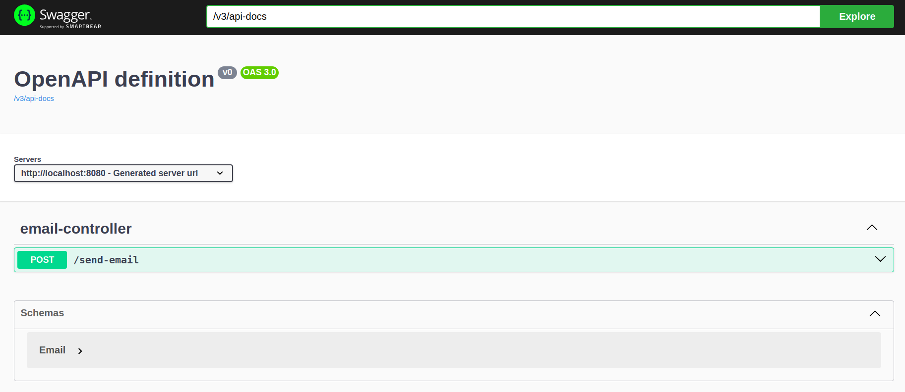
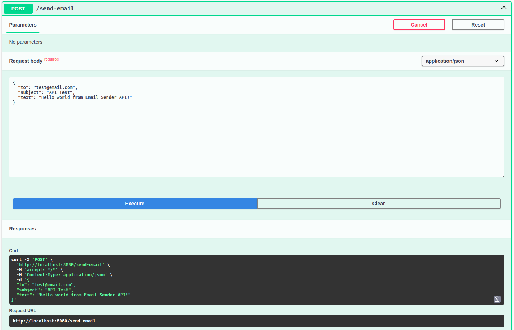
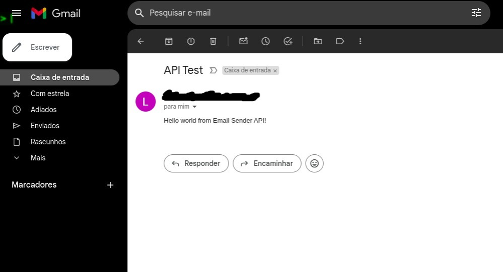

# ✉️ Email Sender API

API for sending *e-mail*

## 📝 Features

- [x] Send simple e-mails

## 👾 Demo





## ❓ How to Use

### ✋ Prerequisites

Before starting, you will need to have the following tools installed on your machine:
[Git](https://git-scm.com), [JDK 17](https://www.oracle.com/java/), [Maven](https://maven.apache.org/). 
Furthermore, it is good to have an editor to work with the code like [VSCode](https://code.visualstudio.com/)

### 🚀 Running

```bash
# Clone this repository
git clone https://github.com/alvesluis0/email-sender-api

# Access the project folder in terminal/cmd
cd email-sender-api
```

Modify the environment variables in the
[application.properties](/src/main/resources/application.properties) file to their respective values

```bash
spring.mail.username=${MAIL_USERNAME}
spring.mail.password=${MAIL_PASSWORD}

# For example
spring.mail.username=example@gmail.com
spring.mail.password=asda qwer uiop zxcv vbnm
```

```bash
# Install the application
mvn package

# Run the application
java -jar target/email-sender-api.jar

# The server will start on port:8080 - access <http://localhost:8080/swagger-ui.html> to test
```

If you are having problems with Authentication, please follow the steps in this
[tutorial](https://www.techmazza.com/solve-java-mail-authentication-failed-exception-in-springboot/)

## 🛠 Technologies

The following tools were used to build the project:

- [Java 17](https://www.oracle.com/java/)
- [Maven](https://maven.apache.org/)
- [Spring Boot](https://spring.io/)
- [Java Mail Sender](https://www.baeldung.com/spring-email)

## 🔖 Learnings

- Sending e-mails
- Validation of an e-mail with _regex_